# Milvus Industrial RAG

Milvus Industrial RAG is a portfolio-ready retrieval augmented generation project for industrial support and incident analysis. It ingests documents into Milvus, supports semantic and hybrid search, and can generate grounded answers from retrieved context with a guardrail check.

## What it does

- Ingests supported documents into Milvus
- Runs semantic search and hybrid reranking
- Generates grounded RAG answers from retrieved chunks
- Records benchmark runs and RAG audit traces

## Architecture Flow

Milvus stores embeddings plus metadata for traceable retrieval across ingestion, search, and answer generation. Guardrails validate whether retrieved context is relevant before generating or accepting an answer.

```mermaid
flowchart LR
    A[Documents / TXT files] --> B[Loader]
    B --> C[Normalizer]
    C --> D[Chunker]
    D --> E[Metadata extractor]
    E --> F[Embedding service]
    F --> G[Milvus collection]
    G --> H[Semantic / filtered / hybrid search]
    H --> I[RAG answer generation]
    I --> J[Relevance guardrail]
    J --> K[Final answer with retrieved evidence]
```



## Project Structure

- `app/collections/` Milvus collection setup and teardown scripts
- `app/ingestion/` loaders, normalization, chunking, and ingestion pipeline
- `app/search/` semantic and hybrid search CLIs
- `app/rag/` grounded answer generation and relevance guardrail
- `app/benchmark/` search benchmark utilities
- `app/db/` Milvus client setup
- `app/embeddings/` embedding service wrapper
- `scripts/` utility scripts such as health checks
- `data/` sample inputs plus generated benchmark and audit outputs

## Requirements

- Python 3.10+
- Milvus running locally or remotely
- OpenAI API access for RAG answer generation

## Setup

1. Create and activate a virtual environment.
2. Install dependencies:

```bash
pip install -r requirements.txt
```

3. Configure a local `.env` file with at least:

```env
MILVUS_HOST=localhost
MILVUS_PORT=19530
MILVUS_DB_NAME=default
OPENAI_API_KEY=your_key_here
OPENAI_BASE_MODEL=your_model_here
```

4. Start Milvus using the bundled Docker compose file:

```bash
cd docker
docker compose up -d
```

## Common Commands

Ingest documents:

```bash
python -m app.ingestion.ingest_pipeline
```

Run semantic search:

```bash
python -m app.search.search_cli --query "voucher recharge failure"
```

Run hybrid search:

```bash
python -m app.search.hybrid_search --query "database listener error"
```

Run grounded RAG:

```bash
python -m app.rag.basic_rag --query "What caused the recharge failure?"
```

Run the benchmark:

```bash
python -m app.benchmark.run_search_benchmark
```

Health check:

```bash
python scripts/health_check.py
```

## Notes

- Local configuration stays in `.env`.
- Generated data, logs, and cache directories are ignored by default.
- The repo is intended to stay lightweight for portfolio review.
